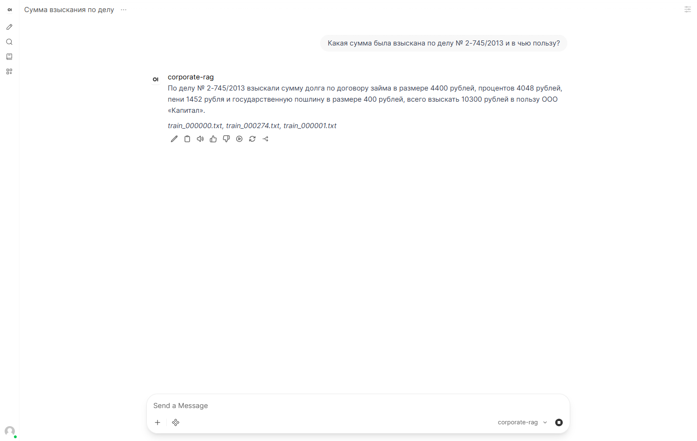
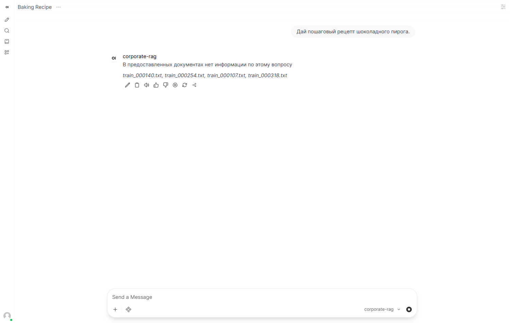
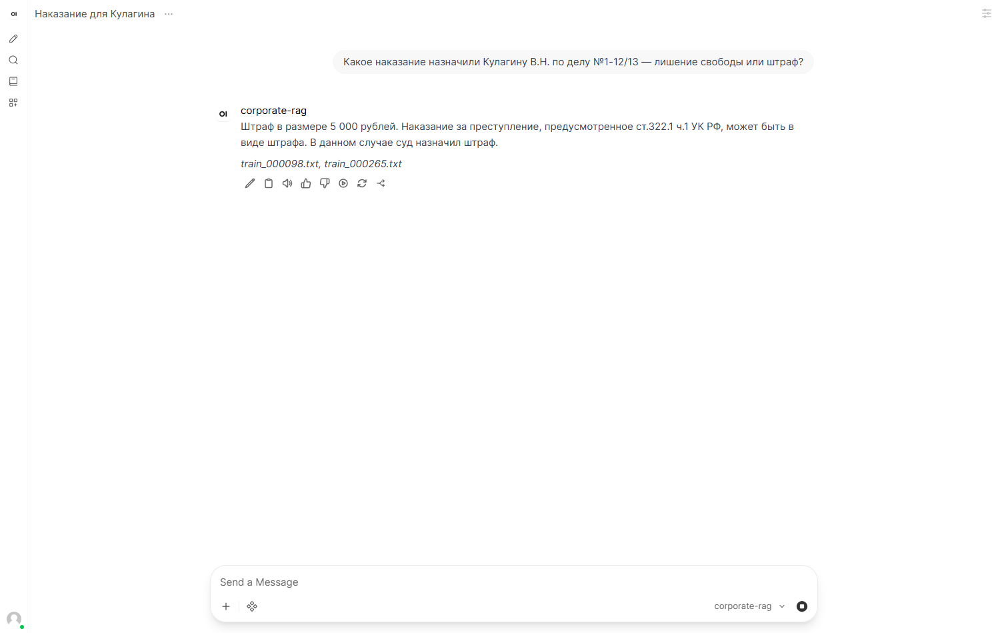

# Enterprise Private GPT — защищённый корпоративный RAG-чат-бот

Домашнее задание «Enterprise Private GPT». Реализована полностью локальная
RAG-система: языковая модель, эмбеддинги и векторная база данных работают на
машине пользователя, без обращения к внешним платным API. Внешние данные не
покидают контур.

## Архитектура

```
                 ┌──────────────────────────┐
                 │        OpenWebUI          │  http://127.0.0.1:8080
                 │  (чат-интерфейс, браузер) │
                 └────────────┬─────────────┘
                              │ OpenAI API
                 ┌────────────▼─────────────┐
                 │   FastAPI RAG-шлюз        │  http://127.0.0.1:8000/v1
                 │  retrieval → prompt → LLM │
                 └───────┬───────────┬──────┘
                         │           │
        ┌────────────────▼──┐   ┌────▼──────────────────┐
        │   ChromaDB        │   │   Ollama              │
        │ (вектора + meta)  │   │ qwen2.5:3b-instruct   │
        └────────▲──────────┘   └───────────────────────┘
                 │ эмбеддинги
        ┌────────┴───────────────────┐
        │ intfloat/multilingual-e5   │
        │ (sentence-transformers)    │
        └────────────────────────────┘
```

Поток данных: документы → очистка → чанкование → эмбеддинги → ChromaDB.
Запрос пользователя → эмбеддинг → поиск top-K → системный промпт с контекстом
→ локальная LLM → ответ со ссылками на источники.

## Стек и обоснование выбора

| Компонент | Выбор | Почему |
|---|---|---|
| LLM | **Qwen2.5-3B-Instruct** (Ollama) | Хорошая поддержка русского, лёгкая для CPU, ставится одной командой |
| Эмбеддинги | **intfloat/multilingual-e5-small** | Мультиязычная, качественная для русского, быстрая на CPU |
| Векторная БД | **ChromaDB** | Простое локальное персистентное хранилище с метаданными |
| Оркестрация | **LangChain** | Загрузка документов, чанкование, retriever, промпты |
| Интерфейс | **OpenWebUI** | Готовый чат, подключается к любому OpenAI-совместимому API |
| Шлюз | **FastAPI + Uvicorn** | Связывает собственный RAG-пайплайн с OpenWebUI |

## Структура проекта

```
hw4/
├── Scripts/
│   ├── config.py             # все настройки (модели, чанки, top-K, пути)
│   ├── embeddings.py         # обёртка multilingual-e5 (LangChain Embeddings)
│   ├── 01_download_data.py   # скачивание RuLegalNER с Google Drive
│   ├── 02_prepare_docs.py    # CSV → чистые .txt документы
│   ├── 03_ingest.py          # чанкование + эмбеддинги → ChromaDB
│   ├── 04_rag.py             # ядро RAG (CLI + библиотека RagEngine)
│   ├── 05_api.py             # OpenAI-совместимый FastAPI-шлюз
│   ├── 06_evaluate.py        # 3 типа тестов + Top-K/latency
│   ├── run_api.ps1           # запуск шлюза
│   └── run_webui.ps1         # запуск OpenWebUI
├── notes/
│   ├── plan.md               # план решения
│   ├── environment.md        # окружение и трудности
│   ├── test_results.md       # результаты тестов
│   └── screenshots/          # скриншоты интерфейса
├── data/                     # документы (генерируется, в .gitignore)
├── storage/                  # ChromaDB и данные OpenWebUI (в .gitignore)
├── requirements.txt          # зависимости RAG-пайплайна
├── requirements-webui.txt    # зависимости OpenWebUI
├── report.ipynb              # Jupyter-отчёт с выполненными ячейками
└── .env.example
```

## Быстрый старт

### 1. Предварительные требования
- Windows 10/11, ~10 ГБ свободного места
- [Ollama](https://ollama.com/download) и Python 3.12

### 2. Модель LLM
```powershell
ollama pull qwen2.5:3b-instruct
```

### 3. RAG-окружение
```powershell
C:\Path\To\Python312\python.exe -m venv .venv
.\.venv\Scripts\python.exe -m pip install -r requirements.txt
```

### 4. Данные и индекс
```powershell
.\.venv\Scripts\python.exe Scripts\01_download_data.py   # ~950 МБ из Google Drive
.\.venv\Scripts\python.exe Scripts\02_prepare_docs.py    # 400 документов
.\.venv\Scripts\python.exe Scripts\03_ingest.py --reset  # ~12 мин на CPU
```

### 5. Запуск шлюза и интерфейса
Отдельные окна PowerShell:
```powershell
.\Scripts\run_api.ps1      # http://127.0.0.1:8000
```
```powershell
# один раз: Python 3.12 venv для OpenWebUI
python -m venv .venv-webui
.\.venv-webui\Scripts\python.exe -m pip install -r requirements-webui.txt
.\Scripts\run_webui.ps1    # http://127.0.0.1:8080
```

При первом входе в OpenWebUI создайте администратора. Модель **corporate-rag**
уже подключена (переменные `OPENAI_API_BASE_URL` и `OPENAI_API_KEY`).

### 6. Проверка без интерфейса
```powershell
.\.venv\Scripts\python.exe Scripts\04_rag.py "Какая сумма взыскана по делу № 2-745/2013?"
.\.venv\Scripts\python.exe Scripts\06_evaluate.py
```

## Результаты тестирования

Полные логи — [`notes/test_results.md`](notes/test_results.md).
Интерактивный отчёт с выполненными ячейками — [`report.ipynb`](report.ipynb).

| Тип теста | Вопрос | Ответ системы | Итог |
|---|---|---|---|
| **По базе** | Какая сумма взыскана по делу № 2-745/2013 и в чью пользу? | «…10300 рублей в пользу ООО «Капитал»» | ✅ верно |
| **Вне базы** | Дай пошаговый рецепт шоколадного пирога | «В предоставленных документах нет информации по этому вопросу» | ✅ отказ |
| **Конфликт фактов** | Кулагину В.Н. по делу №1-12/13 — лишение свободы или штраф? | «Штраф в размере 5 000 рублей» | ✅ приоритет документа |

### Влияние Top-K на latency

| Тип вопроса | top_k=2 | top_k=4 | top_k=8 |
|---|---:|---:|---:|
| По базе | 31.4 с | 37.3 с | 62.5 с |
| Вне базы | 8.7 с | 5.0 с | 7.0 с |
| Конфликт | 18.4 с | 17.6 с | 37.6 с |

Вывод: увеличение Top-K раздувает контекст и время генерации, но не улучшает
ответ. Оптимум для этой базы — **K = 2–4**.

## Скриншоты

| Запрос по базе | Запрос вне базы | Конфликт фактов |
|---|---|---|
|  |  |  |

## Анализ слабых мест

- **Галлюцинации.** При K=8 в контекст попадают нерелевантные дела, и модель
  иногда добавляет «Источники» даже в отказ. Строгий системный промпт и
  разумный K снижают риск, но не исключают полностью.
- **Скорость.** На CPU без GPU ответ занимает от 5 до 60 с. Это главный
  компромисс локального развёртывания.
- **Качество эмбеддингов.** `e5-small` иногда ставит в топ похожие по
  формулировкам, но разные по сути дела; помогает `add_start_index` и
  метаданные источника.
- **Предобработка.** Юридические тексты содержат анонимизацию (`<ДАТА1>`,
  `<АДРЕС>`), что усложняет точные фактологические вопросы.

## Вывод о защите данных

Система **действительно изолирована**: LLM (Ollama), эмбеддинги и ChromaDB
работают локально, наружу уходят только разовые загрузки моделей и датасета
на этапе установки. После установки пайплайн работает офлайн. Для
корпоративного контура это означает, что конфиденциальные документы и запросы
не передаются третьим лицам. Ограничения — физическая безопасность машины и
отсутствие внешнего API-аудита, что решается организационными мерами.
